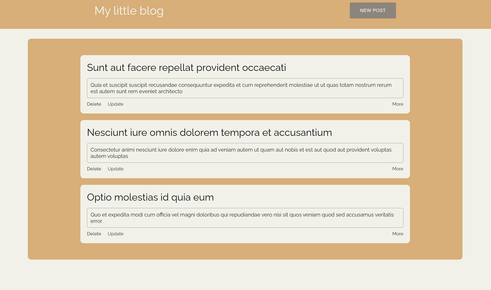

# My Little Blog

## About The Project

You can view all posts, view a single post and its comments, leave comments. And also add, delete and edit posts
## Technologies
* **react : 17.0.2**
* **redux : 4.1.1**
* **react-redux : 7.2.5**
* **redux-thunk: 2.3.0**
* **axios : 0.21.4**
* **sass: 1.39.0**
* **Material UI : 5.0.0-beta.5**

## Available Scripts

In the project directory, you can run:

### `npm start`

Runs the app in the development mode.\
Open [http://localhost:3000](http://localhost:3000) to view it in the browser.

### `npm run build`

Builds the app for production to the `build` folder.\
It correctly bundles React in production mode and optimizes the build for the best performance.

### `npx run lint `

Run lint checks.

### `npm run lint:fix`

Fix lint issues.

